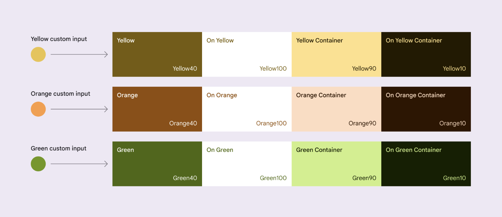

import DynamicColorTheme from '@site/src/components/DynamicColorTheme.tsx';

# Theming

:::note
To observe changes related to switching between light and dark mode in the app, ensure that the <i>"Override force-dark"</i> feature in the <i>"developer options"</i> settings on your Android device is <b>not overridden</b>.
:::

## Applying a theme to the whole app

To support custom themes, paper exports a `PaperProvider` component. You need to wrap your root component with the provider to be able to support themes:

```js
import * as React from 'react';
import { PaperProvider } from 'react-native-paper';
import App from './src/App';

export default function Main() {
  return (
    <PaperProvider>
      <App />
    </PaperProvider>
  );
}
```

By default React Native Paper will apply `LightTheme` if no `theme` prop is passed to the `PaperProvider`, automatically switching to `DarkTheme` when the device color scheme is dark.

## Accessing theme properties

Use the built-in `useTheme()` hook to get access to the theme's variables:

```js
import * as React from 'react';
import { useTheme } from 'react-native-paper';

export default function PaymentScreen() {
  const theme = useTheme();

  return <View style={{ backgroundColor: theme.colors.primary }} />;
}
```

You can also use the `withTheme()` HOC exported from the library. If you wrap your component with the HOC, you'll receive the theme as a prop:

```js
import * as React from 'react';
import { withTheme } from 'react-native-paper';

function PaymentScreen({ theme }) {
  return <View style={{ backgroundColor: theme.colors.primary }} />;
}

export default withTheme(PaymentScreen);
```

## Theme properties

You can change the theme prop dynamically and all the components will automatically update to reflect the new theme.

A theme contains the following properties:

- `dark` (`boolean`): whether this is a dark theme or light theme.
- `colors` (`object`): various colors used throughout different elements.

  > The primary key color is used to derive roles for key components across the UI, such as the FAB, prominent buttons, active states, as well as the tint of elevated surfaces.

  - `primary`
  - `onPrimary`
  - `primaryContainer`
  - `onPrimaryContainer`

  > The secondary key color is used for less prominent components in the UI such as filter chips, while expanding the opportunity for color expression.

  - `secondary`
  - `onSecondary`
  - `secondaryContainer`
  - `onSecondaryContainer`

  > The tertiary key color is used to derive the roles of contrasting accents that can be used to balance primary and secondary colors or bring heightened attention to an element.

  > The tertiary color role is left for teams to use at their discretion and is intended to support broader color expression in products.

  - `tertiary`
  - `onTertiary`
  - `tertiaryContainer`
  - `onTertiaryContainer`

  > The neutral key color is used to derive the roles of surface and background, as well as high emphasis text and icons.

  - `background`
  - `onBackground`
  - `surface`
  - `onSurface`

  > The neutral variant key color is used to derive medium emphasis text and icons, surface variants, and component outlines.

  - `surfaceVariant`
  - `onSurfaceVariant`
  - `outline`

  > In addition to the accent and neutral key color, the color system includes a semantic color role for error

  - `error`
  - `onError`
  - `errorContainer`
  - `onErrorContainer`

  > Surfaces at elevation levels 0-5 are tinted via color overlays based on the primary color, such as app bars or menus. The addition of a grade from 0-5 introduces tonal variation to the surface baseline.

  - `elevation` (`object`)
    - `level0` - transparent
    - `level1` - 5% opacity
    - `level2` - 8% opacity
    - `level3` - 11% opacity
    - `level4` - 12% opacity
    - `level5` - 14% opacity

  > Colors for disabled state

  - `surfaceDisabled`
  - `onSurfaceDisabled`

  > These additional role mappings exist in a scheme and are mapped to components where needed.

  - `shadow`
  - `inverseOnSurface`
  - `inverseSurface`
  - `inversePrimary`
  - `backdrop`

- `fonts` (`object`): various fonts styling properties under the text variant key used in component.
  - [`variant` e.g. `labelMedium`] (`object`):
    - `fontFamily`
    - `letterSpacing`
    - `fontWeight`
    - `lineHeight`
    - `fontSize`
- `state` (`object`): interaction state opacity layers per the Material Design 3 spec.
  - `opacity` - opacities for each interaction state: `hovered` (0.08), `focused` (0.1), `pressed` (0.1), `dragged` (0.16), `disabled` (0.38), `enabled` (1.0)
- `shapes` (`object`): corner radius tokens per the Material Design 3 shape scale.
  - `none` · `extraSmall` · `small` · `medium` · `large` · `largeIncreased` · `extraLarge` · `extraLargeIncreased` · `extraExtraLarge` · `full`
- `motion` (`object`): animation tokens: spring physics, easing curves, and durations.
  - `spring` - spring stiffness/damping configs for `fast`, `default`, and `slow` speeds, each with `spatial` and `effects` variants
  - `easing` - cubic bezier easing curves: `emphasized`, `emphasizedAccelerate`, `emphasizedDecelerate`, `standard`, `standardAccelerate`, `standardDecelerate`, `legacy`, and more
  - `duration` - duration milestones in ms: `short1` (50 ms) through `extraLong4`
  - `prefersReducedMotion` (`boolean`) - automatically set from device accessibility settings by `PaperProvider`
- `elevation` (`object`): maps elevation level names to their numeric values (`level0`–`level5`).
- `roundness` (`number`): **Deprecated.** Use `theme.shapes.*` instead.
- `animation` (`object`): **Deprecated.** Use `theme.motion.*` instead.
  - `scale` - **Deprecated.** Use `theme.motion.prefersReducedMotion` instead.

`PaperProvider` automatically reflects the device's "Reduce Motion" accessibility setting into `theme.motion.prefersReducedMotion` (and the legacy `theme.animation.scale`). To opt out and handle accessibility yourself, pass `accessibilityAdapters={false}` to `PaperProvider`.

## Extending the theme

Keeping your own properties in the theme is fully supported by our library:

```js
import * as React from 'react';
import { LightTheme, PaperProvider } from 'react-native-paper';
import App from './src/App';

const theme = {
  ...LightTheme,
  // Specify custom property
  myOwnProperty: true,
  // Specify custom property in nested object
  colors: {
    ...LightTheme.colors,
    myOwnColor: '#BADA55',
  },
};

export default function Main() {
  return (
    <PaperProvider theme={theme}>
      <App />
    </PaperProvider>
  );
}
```

## Creating dynamic theme colors

Dynamic Color Themes allows for generating two color schemes lightScheme and darkScheme, based on the provided source color.
Created schemes follow the Material Design 3 color system and cover the full color structure of the Paper theme. Use the tool below to generate them:

<DynamicColorTheme />

<br />

Passed source color into the util is translated into tones to automatically provide the range of tones that map to color roles.



_Source: [Material You Color System](https://m3.material.io/styles/color/the-color-system/custom-colors)_

### Using schemes

Once we have copied the color schemes from the generated JSON above, we can use by passing it to the colors in `theme` object as below:

```jsx
import * as React from 'react';
import { LightTheme, PaperProvider } from 'react-native-paper';
import App from './src/App';

const theme = {
  ...LightTheme,
  colors: yourGeneratedLightOrDarkScheme.colors, // Copy it from the color codes scheme and then use it here
};

export default function Main() {
  return (
    <PaperProvider theme={theme}>
      <App />
    </PaperProvider>
  );
}
```

### Sync dynamic colors with system colors

React Native Paper supports Android Material Design dynamic colors (wallpaper-seeded colors) via the pre-built `DynamicLightTheme` and `DynamicDarkTheme` objects. These use React Native's `PlatformColor` API to map all color roles to the system palette:

```tsx
import { useColorScheme } from 'react-native';
import {
  DynamicDarkTheme,
  DynamicLightTheme,
  PaperProvider,
} from 'react-native-paper';
import App from './src/App';

export default function Main() {
  const isDarkMode = useColorScheme() === 'dark';

  return (
    <PaperProvider theme={isDarkMode ? DynamicDarkTheme : DynamicLightTheme}>
      <App />
    </PaperProvider>
  );
}
```

:::info
Dynamic colors require Android 12 (API 31+). On unsupported platforms and older Android versions, `DynamicLightTheme` and `DynamicDarkTheme` fall back to the static `LightTheme` and `DarkTheme` so consumer code stays platform-agnostic. Use the exported `isDynamicColorSupported` constant if you need to gate UI on platform support.
:::

## Adapting React Navigation theme

The `adaptNavigationTheme` function takes an existing React Navigation theme and returns a React Navigation theme using Paper's color scheme. Pass the result to `NavigationContainer` so that React Navigation's UI elements match Paper's colors.

```ts
adaptNavigationTheme(themes);
```

:::info
For users of `react-navigation` version `7.0.0` and above, `adaptNavigationTheme` overrides the **fonts** from the navigation theme as follows:

```ts
fonts: {
  regular: {
    fontFamily: materialTheme.fonts.bodyMedium.fontFamily,
    fontWeight: materialTheme.fonts.bodyMedium.fontWeight,
    letterSpacing: materialTheme.fonts.bodyMedium.letterSpacing,
  },
  medium: {
    fontFamily: materialTheme.fonts.titleMedium.fontFamily,
    fontWeight: materialTheme.fonts.titleMedium.fontWeight,
    letterSpacing: materialTheme.fonts.titleMedium.letterSpacing,
  },
  bold: {
    fontFamily: materialTheme.fonts.headlineSmall.fontFamily,
    fontWeight: materialTheme.fonts.headlineSmall.fontWeight,
    letterSpacing: materialTheme.fonts.headlineSmall.letterSpacing,
  },
  heavy: {
    fontFamily: materialTheme.fonts.headlineLarge.fontFamily,
    fontWeight: materialTheme.fonts.headlineLarge.fontWeight,
    letterSpacing: materialTheme.fonts.headlineLarge.letterSpacing,
  },
}
```

:::

<b>Parameters:</b>

| NAME   | TYPE   |
| ------ | ------ |
| themes | object |

Valid `themes` keys are:

- `reactNavigationLight` () - React Navigation compliant light theme.
- `reactNavigationDark` () - React Navigation compliant dark theme.
- `materialLight` () - React Native Paper compliant light theme.
- `materialDark` () - React Native Paper compliant dark theme.

```ts
// App.tsx
import {
  NavigationContainer,
  DefaultTheme as NavigationDefaultTheme,
} from '@react-navigation/native';
import { createStackNavigator } from '@react-navigation/stack';
import {
  PaperProvider,
  LightTheme,
  adaptNavigationTheme,
} from 'react-native-paper';
const Stack = createStackNavigator();
const { LightTheme: NavigationLightTheme } = adaptNavigationTheme({
  reactNavigationLight: NavigationDefaultTheme,
});
export default function App() {
  return (
    <PaperProvider theme={LightTheme}>
      <NavigationContainer theme={NavigationLightTheme}>
        <Stack.Navigator initialRouteName="Home">
          <Stack.Screen name="Home" component={HomeScreen} />
          <Stack.Screen name="Details" component={DetailsScreen} />
        </Stack.Navigator>
      </NavigationContainer>
    </PaperProvider>
  );
}
```

## TypeScript

By default, TypeScript works well whenever you change the value of the built-in theme's properties. It gets more complicated when you want to extend the theme's properties or change their types. In order to fully support TypeScript, you will need to follow the guide that fits your use-case most accurately:

There are two supported ways of overriding the theme:

1. <b>Simple built-in theme overrides</b> - when you only customize the values and
   the whole theme schema remains the same
2. <b>Advanced theme overrides</b> - when you <i>add new properties</i> or <i>
     change the built-in schema shape
   </i>

### Simple built-in theme overrides

You can provide a `theme` prop with a theme object with the same properties as the default theme:

```js
import * as React from 'react';
import { LightTheme, PaperProvider } from 'react-native-paper';
import App from './src/App';

const theme = {
  ...LightTheme, // or DarkTheme
  colors: {
    ...LightTheme.colors,
    primary: '#3498db',
    secondary: '#f1c40f',
    tertiary: '#a1b2c3',
  },
};

export default function Main() {
  return (
    <PaperProvider theme={theme}>
      <App />
    </PaperProvider>
  );
}
```

### Advanced theme overrides

If you need to modify the built-in theme schema by adding a new property or changing its type, you need to follow these steps:

1. Pass your theme overrides to the PaperProvider component

```ts
import * as React from 'react';
import { LightTheme, PaperProvider } from 'react-native-paper';
import App from './src/App';

const theme = {
  ...LightTheme,

  // Specify a custom property
  custom: 'property',

  // Specify a custom property in nested object
  colors: {
    ...LightTheme.colors,
    brandPrimary: '#fefefe',
    brandSecondary: 'red',
  },
};

export default function Main() {
  return (
    <PaperProvider theme={theme}>
      <App />
    </PaperProvider>
  );
}
```

2. Create a typed `useAppTheme()` hook in your project

```ts
import * as React from 'react';
import { LightTheme, PaperProvider, useTheme } from 'react-native-paper';
import App from './src/App';

const theme = {
  ...LightTheme,

  // Specify a custom property
  custom: 'property',

  // Specify a custom property in nested object
  colors: {
    ...LightTheme.colors,
    brandPrimary: '#fefefe',
    brandSecondary: 'red',
  },
};

export type AppTheme = typeof theme;

export const useAppTheme = () => useTheme<AppTheme>();

export default function Main() {
  return (
    <PaperProvider theme={theme}>
      <App />
    </PaperProvider>
  );
}
```

3. Start using the `useAppTheme()` hook across your components in the whole app

```ts
import * as React from 'react';
import { useAppTheme } from './App';

export default function HomeScreen() {
  const {
    colors: { brandPrimary },
  } = useAppTheme();

  return <View style={{ backgroundColor: brandPrimary }}>...</View>;
}
```

## Material Design 3

React Native Paper implements Material Design 3 exclusively. Customize the default experience by extending `LightTheme` or `DarkTheme` (see [Extending the theme](#extending-the-theme) and [Advanced theme overrides](#advanced-theme-overrides)).

## Applying a theme to a paper component

If you want to change the theme for a certain component from the library, you can directly pass the `theme` prop to the component. The theme passed as the prop is merged with the theme from the `PaperProvider`:

```js
import * as React from 'react';
import { Button } from 'react-native-paper';

export default function ButtonExample() {
  return (
    <Button raised theme={{ roundness: 3 }}>
      Press me
    </Button>
  );
}
```

## Customizing all instances of a component

Sometimes you want to style a component in a different way everywhere, but don't want to change the properties in the theme, so that other components are not affected. For example, say you want to change the font for all your buttons, but don't want to change `theme.fonts.labelLarge` because it affects other components.

We don't have an API to do this, because you can already do it with components:

```js
import * as React from 'react';
import { Button } from 'react-native-paper';

export default function FancyButton(props) {
  return (
    <Button
      theme={{ typescale: { labelLarge: { letterSpacing: 1 } } }}
      {...props}
    />
  );
}
```

Now you can use your `FancyButton` component everywhere instead of using `Button` from Paper.

## Dark Theme

React Native Paper follows the [Material Design 3 dark theme guidelines](https://m3.material.io/styles/color/dark-theme). Dark surfaces use tonal color overlays derived from the primary color to convey elevation.

`PaperProvider` automatically switches between `LightTheme` and `DarkTheme` based on the device color scheme. If you pass a custom `theme` prop, it is used as-is; you can toggle dark mode by changing `theme.dark` or swapping between your own light and dark theme objects.

### Using the operating system preferences

To follow the device's light/dark preference with your own themes, read it with React Native's `useColorScheme()` hook and pick the matching theme:

```tsx
import * as React from 'react';
import { useColorScheme } from 'react-native';
import { DarkTheme, LightTheme, PaperProvider } from 'react-native-paper';
import App from './src/App';

export default function Main() {
  const scheme = useColorScheme();

  return (
    <PaperProvider theme={scheme === 'dark' ? DarkTheme : LightTheme}>
      <App />
    </PaperProvider>
  );
}
```

The hook re-renders when the OS theme changes, so the swap is live.

## Gotchas

The `PaperProvider` exposes the theme to the components via [React's context API](https://reactjs.org/docs/context.html), which means that the component must be in the same tree as the `PaperProvider`. Some React Native components will render a different tree such as a `Modal`, in which case the components inside the `Modal` won't be able to access the theme. The work around is to get the theme using the `withTheme` HOC and pass it down to the components as props, or expose it again with the exported `ThemeProvider` component.

The `Modal` component from the library already handles this edge case, so you won't need to do anything.
