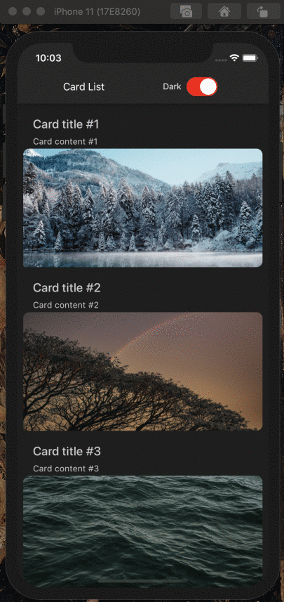

# Theming with React Navigation

In this guide, we will look into how to apply theming for an application using React Native Paper and React Navigation at the same time.

Offering different theme options, especially dark/light ones, has become increasingly a standard requirement of the modern mobile application. Fortunately, both React Navigation and React Native Paper support configurable theming out-of-the-box.
But how to make them work together?

## Themes adaptation

From `v5`, React Native Paper theme colors structure follows the Material Design 3 <i>(known as Material You)</i> colors system, which differs significantly from both the previous Paper's theme and React Navigation theme.

However, to simplify adapting React Navigation theme colors, to use the ones from React Native Paper, it's worth using a utility called `adaptNavigationTheme` – it accepts navigation-compliant themes in both modes and returns their equivalents adjusted to Material Design 3.

```ts
import {
  DarkTheme as NavigationDarkTheme,
  DefaultTheme as NavigationDefaultTheme,
} from '@react-navigation/native';
import { adaptNavigationTheme } from 'react-native-paper';

const { LightTheme, DarkTheme } = adaptNavigationTheme({
  reactNavigationLight: NavigationDefaultTheme,
  reactNavigationDark: NavigationDarkTheme,
});
```

Library exports also Material Design 3 themes in both modes:

```js
import { LightTheme, DarkTheme } from 'react-native-paper';
```

## Combining theme objects

Both libraries require a wrapper to be used at the entry point of the application.
React Navigation exposes `NavigationContainer`, which ensures that navigation works correctly and accepts `theme` as an optional property. Read more about setting up navigation [here](https://reactnavigation.org/docs/getting-started/).
For React Native Paper theme to work, we need to use `PaperProvider` also at the application's entry point.

```js
import { NavigationContainer } from '@react-navigation/native';
import { createStackNavigator } from '@react-navigation/stack';
import { TouchableOpacity } from 'react-native';
import {
  Card,
  Title,
  Paragraph,
  List,
  PaperProvider,
} from 'react-native-paper';

const Stack = createStackNavigator();

const HomeScreen = ({ navigation }) => (
  <TouchableOpacity
    onPress={() =>
      navigation?.push('Details', {
        title,
        content,
      })
    }
  >
    <Card>
      <Card.Content>
        <Title>{title}</Title>
        <Paragraph>{content}</Paragraph>
      </Card.Content>
    </Card>
  </TouchableOpacity>
);

const DetailsScreen = (props) => {
  const { title, content } = props?.route?.params;
  return (
    <List.Section>
      <List.Subheader>{title}</List.Subheader>
      <List.Item title={content} />
    </List.Section>
  );
};

export default function App() {
  return (
    <PaperProvider>
      <NavigationContainer>
        <Stack.Navigator initialRouteName="Home">
          <Stack.Screen name="Home" component={HomeScreen} />
          <Stack.Screen name="Details" component={DetailsScreen} />
        </Stack.Navigator>
      </NavigationContainer>
    </PaperProvider>
  );
}
```

Our goal here is to combine those two themes, so that we could control the theme for the entire application from a single place.

To make things easier we can use [deepmerge](https://www.npmjs.com/package/deepmerge) package. We can install it with:

```bash npm2yarn
npm install deepmerge
```

```js
import {
  NavigationContainer,
  DarkTheme as NavigationDarkTheme,
  DefaultTheme as NavigationDefaultTheme,
} from '@react-navigation/native';
import {
  DarkTheme as PaperDarkTheme,
  LightTheme as PaperLightTheme,
  adaptNavigationTheme,
} from 'react-native-paper';
import merge from 'deepmerge';

const { LightTheme, DarkTheme } = adaptNavigationTheme({
  reactNavigationLight: NavigationDefaultTheme,
  reactNavigationDark: NavigationDarkTheme,
});

const CombinedDefaultTheme = merge(PaperLightTheme, LightTheme);
const CombinedDarkTheme = merge(PaperDarkTheme, DarkTheme);
```

Alternatively, we could merge those themes using vanilla JavaScript:

```js
const { LightTheme, DarkTheme } = adaptNavigationTheme({
  reactNavigationLight: NavigationDefaultTheme,
  reactNavigationDark: NavigationDarkTheme,
});

const CombinedDefaultTheme = {
  ...PaperLightTheme,
  ...LightTheme,
  colors: {
    ...PaperLightTheme.colors,
    ...LightTheme.colors,
  },
};
const CombinedDarkTheme = {
  ...PaperDarkTheme,
  ...DarkTheme,
  colors: {
    ...PaperDarkTheme.colors,
    ...DarkTheme.colors,
  },
};
```

## Passing theme with Providers

After combining the themes, we will be able to control theming in both libraries from a single source, which will come in handy later.

Next, we need to pass merged themes into the Providers. For this part, we use the dark one - `CombinedDarkTheme`.

```js
const Stack = createStackNavigator();

export default function App() {
  return (
    <PaperProvider theme={CombinedDarkTheme}>
      <NavigationContainer theme={CombinedDarkTheme}>
        <Stack.Navigator initialRouteName="Home">
          <Stack.Screen name="Home" component={HomeScreen} />
          <Stack.Screen name="Details" component={DetailsScreen} />
        </Stack.Navigator>
      </NavigationContainer>
    </PaperProvider>
  );
}
```

## Customizing theme

We don't need to limit ourselves to the themes offered by the libraries' default. Both packages allow for custom themes to be applied.
You can learn all about it in their documentation:

- [Theming in React Navigation](https://reactnavigation.org/docs/themes/)
- [Theming in React Native Paper](https://callstack.github.io/react-native-paper/docs/guides/theming)

## React Context for theme customization

Now, we wouldn't want to stay on dark theme forever, which is why we need to gain the ability to control theme dynamically. A bit of state management is needed for this purpose.

React Context proves itself very useful in handling cross-cutting concerns like global theme handling, so we will use just that.

## Creating Context

First, we define our Context.

```js
import React from 'react';

export const PreferencesContext = React.createContext({
  toggleTheme: () => {},
  isThemeDark: false,
});
```

## Using Context

Context Provider should be imported also at the entry point, as we want it to wrap the whole app, for the theme values to be accessible at every component that we have.

```js
import React from 'react';
import { PreferencesContext } from './PreferencesContext';

const Stack = createStackNavigator();

export default function App() {
  const [isThemeDark, setIsThemeDark] = React.useState(false);

  let theme = isThemeDark ? CombinedDarkTheme : CombinedDefaultTheme;

  const toggleTheme = React.useCallback(() => {
    return setIsThemeDark(!isThemeDark);
  }, [isThemeDark]);

  const preferences = React.useMemo(
    () => ({
      toggleTheme,
      isThemeDark,
    }),
    [toggleTheme, isThemeDark]
  );

  return (
    // Context is wired into the local state of our main component, so that its values could be propagated throughout the entire application
    <PreferencesContext.Provider value={preferences}>
      <PaperProvider theme={theme}>
        <NavigationContainer theme={theme}>
          <Stack.Navigator initialRouteName="Home">
            <Stack.Screen name="Home" component={HomeScreen} />
            <Stack.Screen name="Details" component={DetailsScreen} />
          </Stack.Navigator>
        </NavigationContainer>
      </PaperProvider>
    </PreferencesContext.Provider>
  );
}
```

Now that the Context is available at every component, all we need to do is import it. Next, provide the user with some UI element to control changing the theme. We will use `Paper`'s [Switch](https://callstack.github.io/react-native-paper/docs/components/Switch) for this purpose.

```js
import React from 'react';
import { useTheme, Appbar, TouchableRipple, Switch } from 'react-native-paper';
import { PreferencesContext } from './PreferencesContext';

const Header = ({ scene }) => {
  const theme = useTheme();
  const { toggleTheme, isThemeDark } = React.useContext(PreferencesContext);

  return (
    <Appbar.Header
      theme={{
        colors: {
          primary: theme.colors.surface,
        },
      }}
    >
      <Appbar.Content title={scene.route?.name} />
      <Switch color={'red'} value={isThemeDark} onValueChange={toggleTheme} />
    </Appbar.Header>
  );
};
```

And now you can switch between light and dark theme!



Thanks to the linking of themes that we did earlier, switching themes can be controlled with only one piece of state.

React Native Paper components will automatically use the provided theme thanks to the `PaperProvider` that is wrapped around the entry point of our application, but we can also access theme values manually with `useTheme` hook,
exposed by the library. You can see how it's done in the `Header` component code above.

If light/dark themes are not enough for your use case, you can learn more about extending the Material Design theme [here](https://callstack.github.io/react-native-paper/docs/guides/theming#extending-the-theme).

Read more about integrating `Paper` with `React Navigation` in a brilliant [article](https://reactnavigation.org/blog/2020/01/29/using-react-navigation-5-with-react-native-paper/) by [@trensik](https://twitter.com/trensik)
