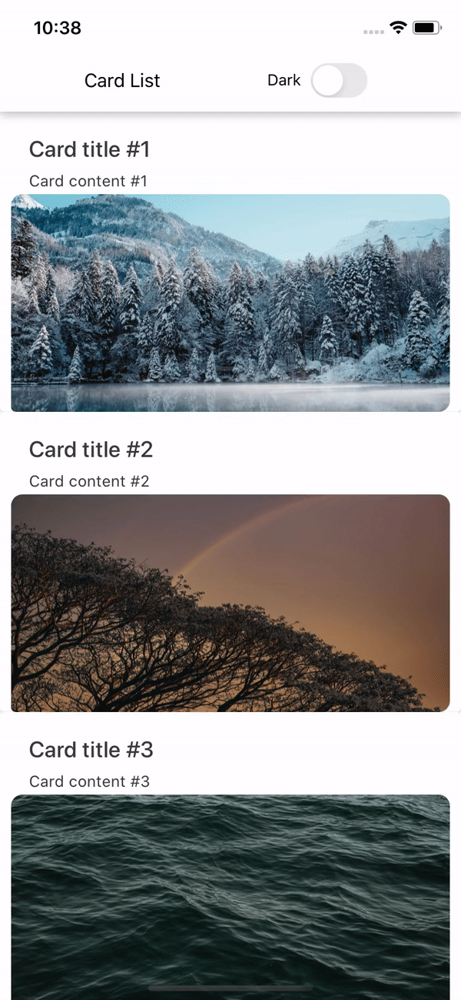

# Theming with React Navigation

In this guide we will look into how to apply theming for an application using React Native Paper and React Navigation at the same time.

Offering different theme options, especially dark/light ones, becomes increasingly a standard requirement of the modern mobile application. Fortunately, both React Navigation and React Native Paper support configurable theming out-of-the-box.
But how to make them work together?

## Combining theme objects

In order for our themes to work together, both libraries require a wrapper to be used at the entry point of the application.
React Navigation exposes `NavigationContainer` which ensures that navigation works correctly, but also accepts `theme` as an optional property. Read more about setting up navigation [here](https://reactnavigation.org/docs/getting-started/).
For React Native Paper theme to work, we need to use `PaperProvider` also at application's entry point.

Fortunately, both React Navigation and React Native Paper offer very similar API when it comes to theming. It's possible to import default themes in light and dark variants from both.

Both libraries use the same name for default themes - `DefaultTheme` and `DarkTheme`, so we need to alias them at the imports.

```js
import { SafeAreaProvider } from "react-native-safe-area-context";
import { createStackNavigator } from "@react-navigation/stack";
import {
  NavigationContainer,
  DarkTheme as NavigationDarkTheme,
} from '@react-navigation/native';
  DefaultTheme as NavigationDefaultTheme,
import {
  DarkTheme as PaperDarkTheme,
  DefaultTheme as PaperDefaultTheme,
  Provider as PaperProvider,
} from 'react-native-paper';

const Stack = createStackNavigator();

export default function App() {
  return (
    <SafeAreaProvider>
      <PaperProvider>
        <NavigationContainer>
          <Stack.Navigator
            initialRouteName={Routes.list}
            headerMode="screen"
            screenOptions={{
              header: ({ scene, previous, navigation, ...rest }) => (
                <Header
                  scene={scene}
                  previous={previous}
                  navigation={navigation}
                  {...rest}
                />
              ),
            }}
          >
            <Stack.Screen name={Routes.list} component={CardScreen} />
            <Stack.Screen name={Routes.details} component={Details} />
          </Stack.Navigator>
        </NavigationContainer>
      </PaperProvider>
    </SafeAreaProvider>
  );
}
```

Our goal here is to combine those two themes into one, so that we could control the theme for the entire application from a single place.

To make things easier we can use [deepmerge](https://www.npmjs.com/package/deepmerge) package. With `yarn` we can install it like this

```sh
yarn add deepmerge
```

```js
import merge from 'deepmerge';

const CombinedDefaultTheme = merge(PaperDefaultTheme, NavigationDefaultTheme);
const CombinedDarkTheme = merge(PaperDarkTheme, NavigationDarkTheme);
```

Alternatively, we could merge those themes using vanilla JavaScript

```js
const CombinedDefaultTheme = {
  ...PaperDefaultTheme,
  ...NavigationDefaultTheme,
  colors: {
    ...PaperDefaultTheme.colors,
    ...NavigationDefaultTheme.colors,
  },
};
const CombinedDarkTheme = {
  ...PaperDarkTheme,
  ...NavigationDarkTheme,
  colors: {
    ...PaperDarkTheme.colors,
    ...NavigationDarkTheme.colors,
  },
};
```

## Passing theme with Providers

After combining the themes, we will be able to control theming in both libraries at the same time, which will come in handy later.

Next, we need to pass merged themes into the Providers. For this part, we use the dark one - `CombinedDarkTheme`.

```js
const CombinedDefaultTheme = merge(PaperDefaultTheme, NavigationDefaultTheme);
const CombinedDarkTheme = merge(PaperDarkTheme, NavigationDarkTheme);

const Stack = createStackNavigator();

export default function App() {
  return (
    <SafeAreaProvider>
      <PaperProvider theme={CombinedDarkTheme}>
        <NavigationContainer theme={CombinedDarkTheme}>
          <Stack.Navigator
            initialRouteName={Routes.list}
            headerMode="screen"
            screenOptions={{
              header: ({ scene, previous, navigation, ...rest }) => (
                <Header
                  scene={scene}
                  previous={previous}
                  navigation={navigation}
                  {...rest}
                />
              ),
            }}
          >
            <Stack.Screen name={Routes.list} component={CardScreen} />
            <Stack.Screen name={Routes.details} component={Details} />
          </Stack.Navigator>
        </NavigationContainer>
      </PaperProvider>
    </SafeAreaProvider>
  );
}
```

At this point, the app will be all dark!


## Customizing theme

We don't need to limit ourselves to the themes offered by the libraries in default. Both packages allow for custom themes to be applied.
You can learn all about it their documentations:

- [Theming in React Navigation](https://reactnavigation.org/docs/themes/)
- [Theming in React Native Paper](https://callstack.github.io/react-native-paper/theming.html)

## React Context for theme customization

Now, we wouldn't want to stay forever with dark theme being on, which is why we need to gain the ability to control theme dynamically. We need to introduce some state management for this purpose.

React Context proves itself very useful in handling cross-cutting concerns like global theme handling, so we will use just that.

## Creating Context

First, we define our Context.

```js
import React from 'react';
import { PaperTheme } from '../types';
type PreferencesContextType = {
  setTheme: (customTheme?: PaperTheme) => void,
  isThemeDark: boolean,
};

export const PreferencesContext =
  React.createContext <
  PreferencesContextType >
  {
    setTheme: () => {},
    isThemeDark: false,
  };
```

## Using Context

Context Provider should be imported also at the entry point, as we want it to wrap the whole app, for the theme values to be accessible at every component that we have.

```js
import { SafeAreaProvider } from 'react-native-safe-area-context';
import { PreferencesContext } from './src/context/PreferencesContext';

const Stack = createStackNavigator();

const CombinedDefaultTheme = merge(PaperDefaultTheme, NavigationDefaultTheme);
const CombinedDarkTheme = merge(PaperDarkTheme, NavigationDarkTheme);

export default function App() {
  const [isThemeDark, setIsThemeDark] = React.useState(false);

  let theme = isThemeDark ? CombinedDarkTheme : CombinedDefaultTheme;

  const toggleTheme = React.useCallback(() => {
    return setIsThemeDark(!isThemeDark);
  }, [isThemeDark]);

  const preferences = React.useMemo(
    () => ({
      toggleTheme,
      isThemeDark,
    }),
    [toggleTheme, isThemeDark]
  );

  return (
    <SafeAreaProvider>
      // Context is wired into the local state of our main component, so that
      its values could be propagated throughout the entire application
      <PreferencesContext.Provider value={preferences}>
        <PaperProvider theme={theme}>
          <NavigationContainer theme={theme}>
            <Stack.Navigator
              initialRouteName={Routes.list}
              headerMode="screen"
              screenOptions={{
                header: ({ scene, previous, navigation, ...rest }) => (
                  <Header
                    scene={scene}
                    previous={previous}
                    navigation={navigation}
                    {...rest}
                  />
                ),
              }}
            >
              <Stack.Screen name={Routes.list} component={CardScreen} />
              <Stack.Screen name={Routes.details} component={Details} />
            </Stack.Navigator>
          </NavigationContainer>
        </PaperProvider>
      </PreferencesContext.Provider>
    </SafeAreaProvider>
  );
}
```

Now that the Context is available at every component, all we need to do is import it. Next thing is to provide the user with some UI element to control changing the theme. We will use `Paper`'s [Switch](https://callstack.github.io/react-native-paper/switch.html) for this purpose.

```js
import * as React from 'react';
import { StackHeaderProps } from '@react-navigation/stack';
import { useTheme, Appbar, TouchableRipple, Switch } from 'react-native-paper';
import { PreferencesContext } from '../context/PreferencesContext';

const Header = ({ scene, previous, navigation }: StackHeaderProps) => {
  const theme = useTheme();
  const { toggleTheme, isThemeDark } = React.useContext(PreferencesContext);

  return (
    <Appbar.Header
      theme={{
        colors: {
          primary: theme?.colors.surface,
        },
      }}
    >
      <Appbar.BackAction
        style={previous ? styles.visible : styles.hidden}
        disabled={!previous}
        onPress={navigation.goBack}
      />
      <Appbar.Content style={styles.appBarContent} title={scene.route?.name} />
      <View style={styles.themeSettingsContainer}>
        <TouchableRipple onPress={() => toggleTheme()}>
          <View style={styles.preference}>
            <Text
              style={{
                color: theme.colors.onSurface,
              }}
            >
              Dark
            </Text>
            <View pointerEvents="none">
              <Switch
                style={[
                  { backgroundColor: theme.colors.accent },
                  styles.switch,
                ]}
                color={'red'}
                value={isThemeDark}
              />
            </View>
          </View>
        </TouchableRipple>
      </View>
    </Appbar.Header>
  );
};

export default Header;
```

And now you can switch between light and dark theme!



Thanks to the linking of themes that we did earlier, switching themes can be controlled with only one piece of state.

React Native Paper components will automatically use provided theme thanks to the `PaperProvider` that is wrapped around the entry point of our application, but we can also access theme values manually with `useTheme` hook,
exposed by the library. You can see how it's done in the `Header` component code above.

If light/dark themes are not enough for your use case, you can learn more about creating Material Design themes [here](https://material.io/design/material-theming/implementing-your-theme.html#color).
On `master` branch of the example app, you will find implemented [Menu](https://callstack.github.io/react-native-paper/menu.html) component, which allows to choose a few custom themes. Inspecting code in `utils` and `Header` may give you some idea how to use your own themes with `Paper`, in addition to dedicated [docs](https://callstack.github.io/react-native-paper/menu.html).

If you would like to follow this guide with an example app, you can use this [repo](https://github.com/matkoson/paperNavigationTheming). Each chapter of this guide is mapped to a specific branch, you can read more in README.

Read more about integrating `Paper` with `React Navigation` in a brilliant [article](https://reactnavigation.org/blog/2020/01/29/using-react-navigation-5-with-react-native-paper/) by [@trensik](https://twitter.com/trensik)
